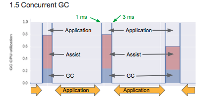

Go 采用的是三色标记回收（Tri-Color Sweep）方式实现的

对于常见的垃圾回收算法，可以参考 :

> * [垃圾回收面面观](http://www.zenlife.tk/gc.md)
> * 更详细的垃圾回收算法可以参见 `Richard Jones` <垃圾回收算法手册> [英文主页看这里](http://gchandbook.org/)

####1. 直观的标记-清扫

Mark-Sweep 最直观的想法就把目前程序中所有正在使用的变量，全部标记出来，剩下的全部清除掉，非常简单， 但同时，简单的做法在实际应用中常常会受到现实中复杂场景的挑战。

**==>> 此时面临着一个问题**

* 标记过程中，程序运行对标记产生干扰，会导致标记混乱（已经标记过的变量A，后又引用了新的变量B，那么B后面会被误认为垃圾回收掉）

**==>> 所以也就产生一个直观的解决办法**

* 标记过程中，停止所有其他的P运行。 P的含义看这里： [Go routine的调用机制](http://morsmachine.dk/go-scheduler)
	
这也就是Stop-The-World的问题由来，为了支持GC运行，所有其他的运行环境都要停止!


####2. 如何减少STW的时间 ？

如何减少STW时间，也可以理解成如何降低时延（Reduced GC Latency）， 基于目前已有的知识很容易想到两个解决办法：

* 单线程的回收改为多线程并行回收（Parallel）
* 把一个长时间的STW时间打散，变成多个小时间片的STW，这样应用程序就会在这中间获得调度，从而达到减少RT的目的；（Incremental）
* 通过一定算法或策略，实现GC和应用程序同时运行；(Concurrent)



从 GO 1.5开始，已经开始组合运用以上各种方法来提升GC的效率，以及减少STW的时间。

####3. Go1.5 垃圾回收过程

[参考文档可见这里](http://www.zenlife.tk/go-gc1.5.md)

Go1.5垃圾回收的实现被划分为五个阶段：

> - GCoff 垃圾回收关闭状态
> - GCscan 扫描阶段
> - GCmark 标记阶段，write barrier生效
> - GCmarktermination 标记结束阶段，STW，分配黑色对象
> - GCsweep 清扫阶段

从比较宏观的角度，描述Go1.5的GC流程：

> 1. 从GCoff切换到GCscan阶段
> 2. 等待所有P都获知这个变化。这时所有的goroutine都会经过一个GC安全点，并且知道当前进入了GCscan阶段
> 3. 扫描各个goroutine栈，将所有遇到的指针标记并插入队列
> 4. 切换为GCmark阶段
> 5. 等待所有P获知这处变化
> 6. write barrier生效，所有的黑色/灰色/白色对象到白色对象的修改都会被捕获，标记并插入队列。malloc会分配白色对象
> 7. 同时，GC会遍历并标记所有可达的对象
> 8. GC完成对堆的标记之后，会依次处理P，从队列中拿出一些对象
> 9. 一旦GC将队列中所有的对象都处理完了，将进入到下一个阶段：GCmarktermination
> 10. 等待所有P获知这处变化
> 11. malloc现在分配黑色对象，未标记的可达对象会不断地减少
> 12. 再一次地，从队列中拿出对象并标记所有没被标记到的可达对象
> 13. 当所有P都处理完毕，并且没有新的灰色对象了(意味着所有可达对象都标记了)，切换到GCsweep阶段
> 14. 等待所有P获知这处变化
> 15. 从现在开始，malloc分配白色对象(使用之前需要sweep span)。不再需要write barrier
> 16. GC后台sweep
> 17. sweep完成之后，切换回GCoff，等待下一轮


Note: golang gc后面的目标就是把Mark termination的这块STW去掉；

基于Google官方的GC1.5的latency测试：


下面分开看一下面的每一个阶段：

***Scan阶段：*** GC从`全局变量`、`赋值器线程栈`、`寄存器可达对象` 获取到Root变量，并将变量标记为灰色;

***并行BackGroudMark***
1.7.4 的源码启动如下：

```go
<!--// gcBgMarkStartWorkers prepares background mark worker goroutines.-->
<!--// These goroutines will not run until the mark phase, but they must-->
<!--// be started while the work is not stopped and from a regular G-->
<!--// stack. The caller must hold worldsema.-->
func gcBgMarkStartWorkers() {
	// Background marking is performed by per-P G's. Ensure that
	// each P has a background GC G.
	for _, p := range &allp {
		if p == nil || p.status == _Pdead {
			break
		}
		if p.gcBgMarkWorker == 0 {
			go gcBgMarkWorker(p)
			notetsleepg(&work.bgMarkReady, -1)
			noteclear(&work.bgMarkReady)
		}
	}
}
```

Note: 对于Mark过程，实际上也是并发(Conncurrently), 这里就涉及到一个WriteBarrier的问题，可以想见上面引用的资料里面的内容。多个mark是根据什么来划分任务的：

***并行sweep*** 

```go 
	for {
		for gosweepone() != ^uintptr(0) {
			sweep.nbgsweep++
			Gosched()
		}
		lock(&sweep.lock)
		if !gosweepdone() {
			// This can happen if a GC runs between
			// gosweepone returning ^0 above
			// and the lock being acquired.
			unlock(&sweep.lock)
			continue
		}
		sweep.parked = true
		goparkunlock(&sweep.lock, "GC sweep wait", traceEvGoBlock, 1)
	}
```

`Note：` 从代码里面可以看出，Sweep的过程也是并行处理的；那么多个协程同时sweep，任务是根据什么来划分的呢，从 gosweepone实现可以看出来，是根据内存页来区分的；


***GC Ternination *** 

现在唯一存在STW的地方

GC Termination 在STW期间主要干的事：
>  * StopTheWorld
>  * 关闭markrootDone
>  * 关闭gcBlackenEnabled
>  * 唤醒所有的Assists
>  * 做一些统计性工作
>  * StartTheWorld
>  * 启动GcSweep （通过systack调用）


GC1.7.3 中的端倪：

> TODO(austin): The rest of this comment is woefully out of date and
> needs to be rewritten. There is no distinct scan phase any more and
> we allocate black during GC.


####4. GC触发条件源码解析

* 强制GC
	长时间没有GC，可以
* 堆大小满足扩展条件
	
	默认最小值是4MB，代码中的定义为：`const defaultHeapMinimum = 4 << 20`
下一次GC开始的阈值： 

```go 
	memstats.next_gc = uint64(float64(memstats.heap_reachable) * (1 + gcController.triggerRatio))
	if memstats.next_gc < heapminimum {
		memstats.next_gc = heapminimum
	}

	if gcController.triggerRatio > float64(gcpercent)/100 {
		gcController.triggerRatio = float64(gcpercent) / 100
	}
	
	//gcpercent默认值: gcpercent 可以从环境变量中读取，如果没有的话默认为100， 所有GC阈值每次是翻倍的
```

* 在分配一些大内存时，发现内存不够用了，那么GC一次吧 ```func mallocgc(size uintptr, typ *_type, needzero bool) unsafe.Pointer ```

* Debug的时候，Free 一下 OSMemory
```func runtime_debug_freeOSMemory() ```

####5. 实践应用

**如何查看GC**

启动程序的时候加上 `GODEBUG=gctrace=1`
> GODEBUG=gctrace=1 ./jaws

输出结果的含义：
	


**如何避免GC过大的消耗**

* GC的实现机制越来越复杂，并行性和并发性越来越好，主要还是靠GC本身的优化，但是我们自身还是要避免过多的垃圾内存的使用；
* 避免过多的全局变量
* 避免过多的堆内存分配； 其中比较多多Slice是变长的，每次改变都会产生一些垃圾内存；
* 没事不要调用runtime.GC()，这个接口是全局STW的；（切记！）


